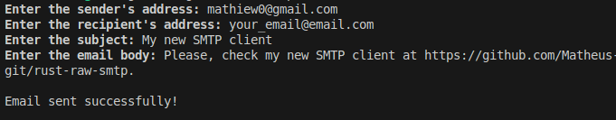
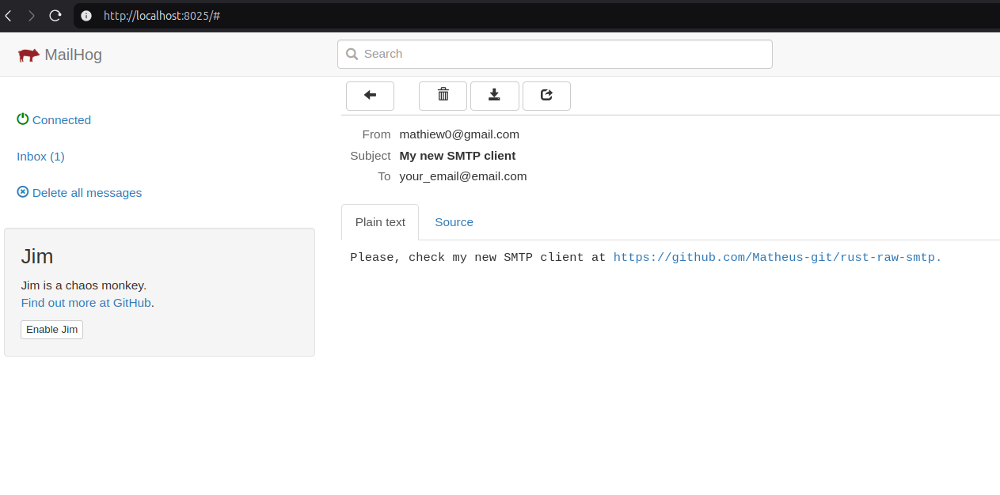

# Rust Raw SMTP


A lightweight and efficient raw SMTP client built with Rust. This project provides a simple implementation for sending emails via SMTP without relying on third-party libraries. For local testing, MailHog is used as the SMTP server.

**This project was developed in just a few hours as part of a training exercise over the weekend.**

## Architecture

This project follows a layered architecture, applying concepts from Domain-Driven Design (DDD) such as Factory and Repository patterns. Additionally, the Template Method pattern is used to define a generic workflow for sending emails while allowing specific customizations.

## Screenshots




## Requirements

- **MailHog**: Ensure MailHog is running, check https://github.com/mailhog/MailHog
- **Cargo**: Ensure you have Cargo (Rust's package manager) installed.

## Usage

1. Clone the repository:
    ```
      git clone https://github.com/Matheus-git/rust-raw-smtp.git
    ```
2. Navigate to the project directory:
    ```
      cd rust-raw-smtp
    ```
3. Create and configure a `.env` file, if necessary.
    ```
      cp .env.example .env
    ```
4. Run application:
    ```
      cargo run
    ```
4. Check e-mail at local MailHog:

    http://localhost:8025/#

## Contributing

Contributions are welcome! Please open an issue or submit a pull request for any improvements or bug fixes.

## 📝 License

This project is open-source under the MIT License.
